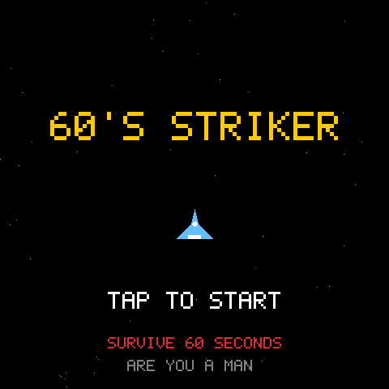
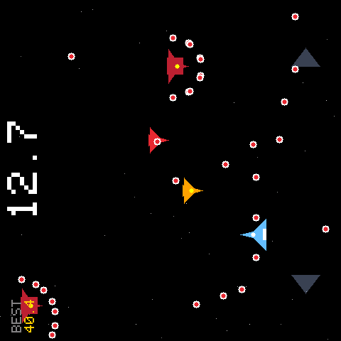
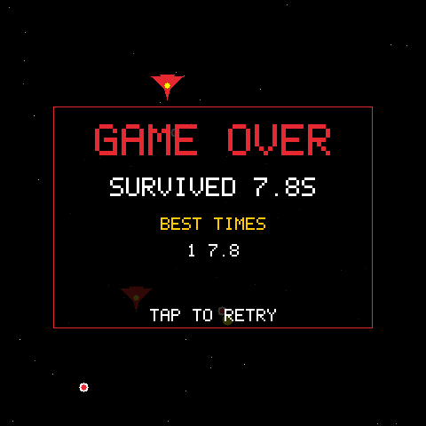
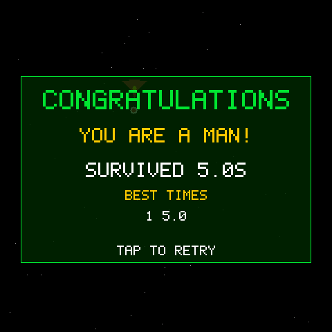

# 60's Striker —— 是男人就坚持 60 秒

基于 **ESP-Mosaico**（ESP32-S31 + 480×480 显示屏 + 交互子板）复刻的经典弹幕生存游戏：一条命、不能射击、只用左右移动，在越来越疯狂的字弹地狱里**坚持 60 秒**。



## 玩法

- **一条命、不能射击**——你唯一的武器是走位。左右移动，躲开一切。
- 顶部巨大的生存计时器实时跳动：`23.4`、`41.7`……看着它活过 60 秒。
- 撑过 **60.00 秒** → `CONGRATULATIONS · YOU ARE A MAN!`（你是男人！）；
  中弹死亡 → 结算本局生存时间，按键**秒开下一局**。
- **生存时间排行榜 Top 5**（0.1 秒精度），保存在设备 NVS 中，重启不丢。

| 玩法 | 死亡结算（含排行榜） | 胜利 |
| --- | --- | --- |
|  |  |  |

## 难度设计（经典曲线）

复刻原版 Flash 游戏的成瘾性节奏——**前几秒几乎空场，之后逐级解锁**：

| 时间 | 解锁内容 |
| --- | --- |
| 0–3 s | 宽限期：场上几乎无弹，热身走位 |
| 3 s | 第一个敌机进场（且 2 秒后才开第一枪） |
| 5 s | 顶部弹雨开始（间隔从 3 s 逐渐压到 0.4 s） |
| 全程 | 瞄准弹 / 三向散射 / 环形弹，密度与速度随时间线性爬升至 **2 倍** |
| 32 s | 带缺口的弹墙（惩罚站桩） |
| 45–60 s | 全类型齐发，最终狂潮 |

## 操作

| 输入 | 动作 |
| --- | --- |
| 交互子板 **左 / 右实体键** | 左右移动（按住持续移动，松开即停） |
| 屏幕左下 / 右下角 **半透明箭头**（触摸区） | 同上，无子板时的后备；箭头绘制在子弹层之下，不遮挡弹幕 |
| 任意键 / 触屏（标题或结算画面） | 开始 / 重开一局 |
| Host 模拟器 | `A` / `D` 移动，`W` / `S` 纵向（调试用），`P` 暂停 |

**屏幕重力旋转**：交互子板插在右侧时画面自动旋转 90°——子板永远位于画面下方，握持方向即操作方向。

## 技术亮点

- **弹幕引擎**：480×480 RGB565 画布上 30 fps 软件渲染，零图片资源——全部图形由矢量图元与自绘 5×7 像素字体构成（字体支持 90° 旋转渲染），固件仅 1.3 MB。
- **交互子板按键驱动修复**：按键焊盘与触摸电极共用且**没有内部上拉**（实测主动充 3.3 V 后仍读低），普通 GPIO 读取会在按压后锁死数分钟。补丁实现了**充电式读取**——每个采样周期先把焊盘充到高电平再采样，配合非对称去抖（按下 2 次确认 / 松开 1 次立即）与航向保持（两键冲突时保持当前方向，抑制相邻焊盘互容耦合的幻影信号），做到"按下即动、松开即停"。
- **CST9220 触摸驱动自愈**：针对 LCD 触摸控制器每秒自校准产生的无效帧突发与偶发楔死，本地化补丁只在连续 300 帧异常后重建触摸模式序列。
- **可移植架构**：游戏模型是纯 C（Host 模拟器与设备共用同一份代码），输入/渲染分层适配；Host 网页模拟器支持录制回放与脚本化测试（本次开发中完成了 8 步输入矩阵的自动化验证）。
- **排行榜持久化**：NVS blob 存储，游戏通过保存回调解耦存储实现。

## 硬件与构建

**硬件**：ESP-Mosaico 主机（ESP32-S31，CO5300 480×480 QSPI 屏）+ 交互子板（右槽）。

**构建**（需要 ESP-IDF `7b9cc1ac…` 与 workspace 布局，见 [docs](docs/)）：

```sh
git clone https://github.com/zaxchou/esp-mosaico-striker.git
cd esp-mosaico-striker
git submodule update --init submodule/esp-mosaico-utils submodule/raylib-lite-engine
git apply patches/0001-bsp-interact-charged-key-read.patch   # 交互子板按键驱动修复
python mosaico.py game sim  --project projects/striker1945   # Host 网页模拟器
python mosaico.py game build --project projects/striker1945  # 设备固件
python mosaico.py iris system-update --project projects/striker1945  # 安装到设备
```

**固件**（`firmware/`）：

- `striker1945-system-update.irisfw` —— **ESP-Iris 系统更新包**（赛事方要求的无线烧录格式，含应用镜像与元数据清单，通过 `mosaico.py iris system-update` 或 ESP-Iris Gateway 空中下发安装）。
- `striker1945.bin` —— 应用分区裸镜像（esp32s31）。

> 自行安装请保持 workspace 布局后执行 `python mosaico.py iris system-update --project projects/striker1945`，它会用源码重新构建并校验 .irisfw，走保留 Recovery 契约的完整安装流程。

## 目录结构

```
projects/striker1945/     游戏源码（main/ 游戏模型+渲染+输入适配, components/ 本地驱动补丁）
patches/                  BSP 交互子板按键驱动补丁（git apply 方式提供）
firmware/                 比赛固件（.irisfw 无线烧录包 + .bin 应用镜像）
projects/striker1945/screenshots/   游戏截图
submodule/                上游 BSP / 引擎 / 工具链（pinned gitlinks）
```

## 已知限制

- 触摸外设路径读取按键在实测中不可用（焊盘无上拉导致基准漂移），最终方案为 GPIO 充电读取；LCD 触摸控制器的自校准警告（约每秒一次）为正常现象，不影响触摸操作。
- 屏幕左下/右下的半透明箭头与实体按键功能相同，作为无子板时的触屏后备；箭头绘制在弹幕层之下，半透明不遮挡画面。

---

*ARE YOU A MAN?*
